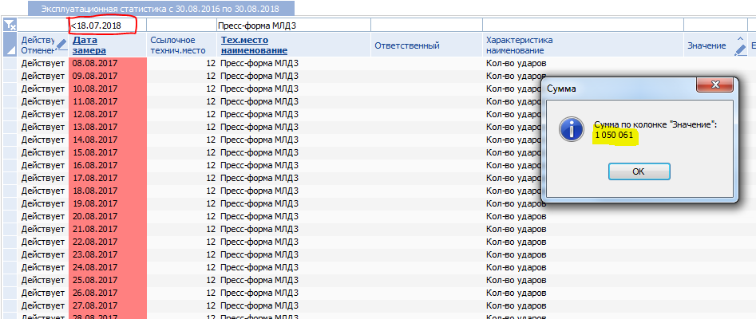

# Фиксация наработки

## Снятие и установка на тех место

Добавление технического места (пресс-форма МЛД 1,2,3,4,5,6,7,8), для последующей установки пресс-формы на оборудование

.png>)

Передвинуть техническое место на стадию «Действует»

.png>)

Из папки Пресс-формы, захватить мышкой и перенести во вновь созданное тех. место, необходимую пресс-форму (которая установлена на данный момент)

.png>)

При переносе указать, что это «Объект ремонта»

.png>)

Указать дату снятия с технического места

.png>)

Выбрать из предложенного списка необходимую пресс-форму

.png>)

Указать дату установки на техническое место

.png>)

При запросе о переносе технических мест, необходимо нажать «Да»

.png>)

## Цепочки оборудования

Переходим в «Цепочки оборудования (схемы цепей аппаратов)»

.png>)

По кнопке «Добавить» необходимо добавить цепочку оборудования, указав «Наименование»

.png>)

Чтобы добавить цепочку, необходимо сначала выбрать каталог «Пресс-форма МЛД2» и нажать «Цепочки оборудования» - «Включить цепочку»

.png>) .png>)

При запросе «Прописать схему цепей на входящие элементы» нажать «Нет»

.png>)

Аналогично добавить саму МЛД№2 BUHLER 180

.png>)

Переходим в «Параметры цепочки оборудования», если нет параметра «УДАР», то необходимо добавить параметр «Кол-во ударов (УДАР)»

.png>)

Так же необходимо этот параметр переместить из «Параметры эксплуатационной статистики» в «Параметры цепочек оборудования» по кнопке «Цепочки оборудования» - «Включить цепочку»

.png>)

## Планировщик задач

Переходим в «Планировщик задач», необходимо запустить «ТОРО. Копирование наработки по схеме цепей аппаратов.»

.png>)

Переходим в «Управление состоянием производственных фондов» и в столбце «Объект ремонта код» нажимаем на объект ремонта Пресс-формы МЛД2

.png>)

## **Подготовительный этап**

1. Нормы периодичности ТОиР (проверка уровней ремонтов)

.png>)

ТО 1 200 000 – Капитальный ремонт – 1 уровень

ТО 600 000 – Капитальный ремонт – 2 уровень

ТО 200 000 – Средний ремонт – 3 уровень

ТО 50 000 – Текущий ремонт – 4 уровень

Так же необходимо проверить правильность заполненных норм периодичности ТОиР

Переходим в нормы периодичности и открываем карту:

.png>)

Создание фактических дат ремонта в плане-графике ТОиР, где:

1. Вид ремонта соответствует виду ремонта в нормативе периодичности.

.png>)

*
  1. Расчёт фактической даты начала ремонта для каждого уровня ТО
     1. Если ремонты не проводились (например, ТО 1 200 000 и ТО 600 000) (текущая наработка меньше уровня ТО наработки, например, Текущая наработка = 400 000 < ТО 600 000), ставим «ДатаНач» и «ДатаКон» 01.01.2012 00:00

.png>)

*
  *
    1. Если ремонты проводились, необходимо рассчитать даты последних ремонтов.

Так как в систему IT-Enterprise каждый день передаются данные о наработке из 1с УПП, то для расчёта даты последних ремонтов необходимо использовать «Эксплуатационную статистику»

Заходим в «Обслуживание по состоянию» .png>), ставим в фильтре дату ниже 2017 года, пример:

.png>)

Далее, чтобы появились данные о количестве ударов необходимо выключить фильтр, по клавише F6 и нажать на значок «снять фильтр»

.png>)

После снятия фильтра необходимо сделать сортировку по полю «Тех. Место. Наименование»

К примеру нам надо посмотреть наработку для млд № 3:

.png>)

Теперь если нажать правой клавишей мыши на колонку «Значение», в выпадающем списке необходимо выбрать «Сумма по колонке»

.png>)

Получаем количество ударов по млд3 за определённый период времени

.png>)

Судя по этим данным получается, что ТО 1 200 000 ещё не проводилось, ТО 50 000 проводилось 46 154 ударов назад.

С помощью фильтра по «Дате замера» необходимо найти дату с наработкой примерно равной 1 050 000 . В фильтре необходимо поставить знак «меньше» - <18.07.2018

Как видно на скриншоте примерная дата когда проводился ТО 50 000 – 18.07.2018

В расчёте плана для ТО 50 000 необходимо установить «ДатаНач» и «ДатаКон» 18.07.2018

Аналогично необходимо рассчитать даты и добавить в планы для ТО 200 000 и ТО 600 000.

После добавления планов, заходим в планировщик и выполняем задачу «Заполнить наработку из планов осмотра в план график ППР»

Теперь в строках плана появиться фактическая наработка

.png>)

Далее необходимо запустить расчёт формирования строк плана.

Необходимо встать на любую строку плана и нажать F2, в выпадающем списке необходимо нажать «Расчет план-графика ТОиР»

.png>)

После расчёта необходимо проверить правильность рассчитанного плана:

.png>)

ВНИМАНИЕ! Если в строках плана есть строки с признаком «+» в графе «ПР Утверждения», то это признак **утвержденной строки**, такие строки нельзя корректировать и робот по расчету план-графика их так же не пересчитывает. Этот признак устанавливается автоматически, когда

Вы выполняете перенос срока заявки на ТОиР методом по F2 оно автоматом переносит и строку плана и утверждает ее переносом срока.

Вы говорите системе принудительно - хочу ремонт в эту дату, и таким образом система защищает эту строку от модификации.

.png>)
