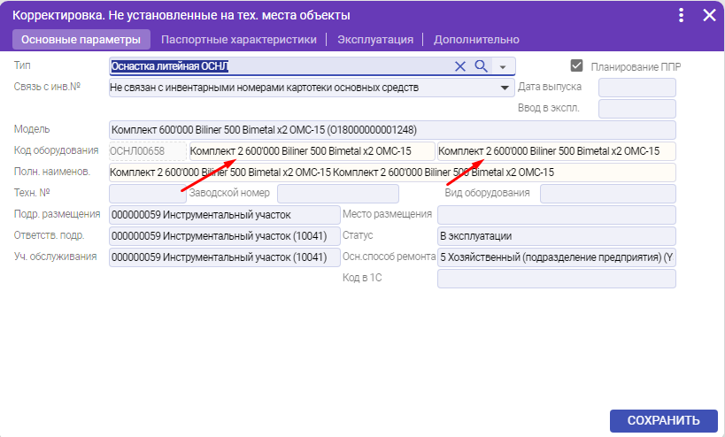
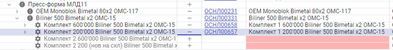

# Технические места Пресс-формы

## Добавление технического места (пресс-форма МЛД)

.png>)

.png>)

Передвинуть техническое место на стадию «Действует»

.png>)

Из папки Пресс-формы, захватить мышкой и перенести во вновь созданное тех. место, необходимую пресс-форму (которая установлена на данный момент).png>)

При переносе выбрать «На уровень ниже» или «Техническое место»

.png>) .png>)

## Состав пресс-формы

Сама пресс-форма Biliner 500 Bimetal х4 OMC-90 является оборудованием, а комплекты узлом оборудования, которые в неё входят

Пример:

.png>)

На пресс-форму Biliner 500 Bimetal х4 OMC-9 должен быть установлен объект ремонта, для этого нажимаем «+»

.png>)

Выбираем среди не установленных объектов нужную пресс-форму кликнув два раза по ней или выбрав и нажать кнопку «Выбрать»

.png>)

Добавляем дату установки оборудования на тех. место и нажимаем «ОК»

.png>)

Комплекты являются узлами оборудования, их обычно 1-2

.png>)

.png>)

На каждый комплект есть свой объект ремонта, устанавливаемый аналогично шагам в пресс-форме

Для замены комплекта на новый, необходимо:

* Нажать на «-», чтобы снять использованный комплект, например Комплект 2 600'000 Biliner 500 Bimetal х4 OMC-90

.png>)

* Добавить дату снятия и нажать «ОК»

.png>)

* Нажать «+» для установки объекта ремонта

.png>)

* Выбираем другой комплект, например Комплект 1 600'000 Biliner 500 Bimetal х4 OMC-90 кликнув по нему два раза

.png>)

* Добавить дату установки оборудования и нажимаем «ОК»

.png>)

## Исправление занесенных тех. мест

Выбираем узлы оборудования, снимаем с них объекты ремонта и возвращаем на стадию «действует» нужные комплекты (рекомендуется содержащие в себе узлы, т.к. удалить можно только пустые комплекты), в данном случае оставляем два «Комплект 1», а два «Комплект 2» двигаем вперёд на стадию «Отменено»

.png>)

Открываем действующие комплекты и стираем нумерацию, т.к. тех. место должно быть в единственном экземпляре, а для него мы уже будем выбирать комплекты как объекты ремонта

.png>)

Должно получится следующее:

.png>)

Далее нужно добавить для них объекты ремонта нажимая «+» и выбрать нужный:

.png>)

В случае если имеются два одинаковых объекта, то нужно их откорректировать по нумерации:

.png>)

После корректировки названия нажимаем «ДА» и «СОХРАНИТЬ»

.png>)

После добавление объектов ремонта и корректировок, пресс-форма должна иметь данный вид:

При фактической замене комплектов, нужно будет снять у нужной пресс-формы с нужного комплекта объект ремонта (Например, комплект 1 600.000) и установить другой объект ремонта (Например, комплект 2 600.000)
