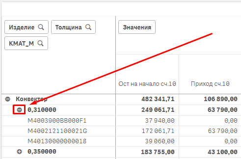
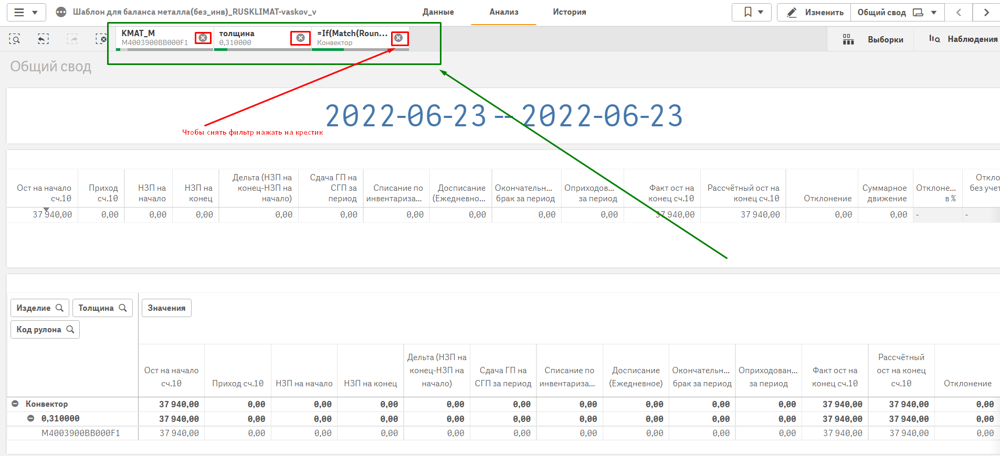
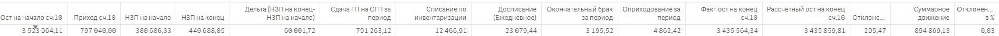
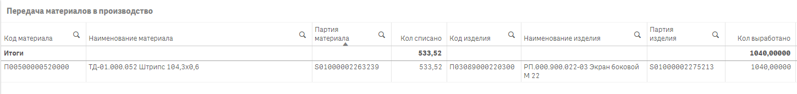

# Баланс рулонной стали

«Баланс рулонной стали», реализованный в BI – инструменте Qlik Sense. Открываем Qlik Sense по ссылке [**https://ite-qlik.rusklimat.ru/hub**](https://ite-qlik.rusklimat.ru/hub)

## **Формирование данных**

В открывшемся окне слева нужно выбрать поток (закладку) Everyone (на скриншоте отмечено красным прямоугольником)

1.png>)

Далее нажать на картинку с рулоном стали

1.png>)

Мы зашли в приложение – теперь нам нужно нажать на указанный на скриншоте лист (щёлкнуть ЛКМ внутри площади выделенного красным цветом прямоугольника)

1.png>)

Теперь на листе щёлкаем на значок «Выберите период»

>Если строить отчёт по вчерашний день, то делать это после 11 часов утра

1.png>)

Открывается окно с возможностью выбора даты – стрелки (выделено красным) – навигация по месяцам, для выбора требуемых дат нужно нажать на первую дату диапазона левой кнопкой мыши и, не отпуская её, вести курсор мыши до последней даты диапазона – по ходу выполнения выбираемые даты будут выделяться зелёным. На последней требуемой дате диапазона левую кнопку мыши отпустить

1.png>)

После выборки дат они отобразятся на листе (отмечено красным цветом). Дальше следует нажать на кнопку (прямоугольник в левом нижнем углу) под названием «Создать без инв» (Синяя стрелка)

1.png>)

После нажатия на кнопку в левой нижней части экрана появится небольшое окно, в нём нужно нажать на кнопку «создать новое приложение». (На скриншоте отмечено красными прямоугольниками и указан порядок нажатия)

1.png>)

После нажатия на кнопку «Создать новое приложение», в окне приложений появляется индикация загрузки нового приложения

1.png>)

Когда приложение загрузится, значок 1.png>) сменится на 1.png>). Для открытия получившегося приложения нужно нажать один раз ЛКМ на значок двух прямоугольников. (Красная стрелка на скриншоте ниже).

1.png>)

Вы открыли сформированное на заданные даты приложение по балансу стали

1.png>)

Каждую таблицу можно развернуть на весь экран нажатием на кнопку “Во весь экран”

1.png>)

После этого для выхода из полноэкранного режима нужно нажать на кнопку «Закрыть полноэкранный режим»

1.png>)

В нижней таблице можно настраивать необходимый уровень детализации (изделие, толщина, номенклатура рулона). Для этого нужно нажать на +, развернется перечень. Свернуть обратно – нажать на минус.

1.png>) 

Если интересен только ограниченный перечень номенклатур/толщин, то их можно выбрать одинарным щелчком левой кнопки мыши по коду рулона/толщине/изделию и последующим щелчком по зеленой галочке. (на скрине отметил зелёными стрелками.) Для отмены выбора нажать на красный крестик. (на скрине красная стрелка)

1.png>)

Все выбранные данные отображаются на панели фильтров, на скриншоте эта область выделена зелёным прямоугольником. Чтобы снять фильтр, нажать на крестик (на скрине выделено красным)

## **Описание данных**

Вид приложения и общая информация

1.png>)

### Основные параметры

* Ост на начало/ Ост на конец счёт 10 – данные об остатках рулонов - подгруппы ('М4003','М4013','М4002’) на начало заданного периода. Реализовано путём ежедневного сохранения таблицы остатков (STOCKEX\_) из базы в Qlik Sense.
* Приход сч.10 – данные берутся из реестра документов, тип процесса «Приход ТМЦ от поставщика», группа М40, подгруппы ('М4003','М4013','М4002’), учитываются все приходы за период.
* НЗП на начало/ НЗП на конец (переведенное в кг) – из таблицы остатков в Qlik Sense выбираются данные на начало/конец периода со счетов 20.011 и 28.02 (исправимый брак). – Получаем перечень партий. Далее нам нужно получить веса этих партий. Рассмотрим этот процесс более подробно далее.
* Сдача ГП на СГП – реестр документов, тип процесса «Сдача продукции на СГП (пооперационный учет)», выборка по площадке СПР. Учитываются сдачи за весь выбранный период
* Списание по инвентаризации – реестр документов, тип процесса «05 Отклонение инвентаризации (материалы и ДСЕ)» (\_INVD). Тип строки – недостача. Выборка по площадке СПР. Выбираем из реестра строки, у которых отсутствуют данные в столбце «Уникальный номер документа основания» Учитываются данные за весь выбранный период. Получаем набор из кода и количества партий. Получение весов выбранный партий рассмотрим далее.
* Досписание (ежедневное) – аналогично предыдущему пункту, но обязательно наличие данных в столбце «Уникальный номер документа основания».
* Окончательный брак за период – в этот столбец попадают данные из двух типов процессов - Передача в окончательный брак (PR\_M333IS) и Акт возникновения окончательного брака (\_PR\_M339). Выбор площадки СПР. Учитываются данные за весь выбранный период – учитываем именно дату разноски документа.
* Оприходование за период – тип процесса «Оприходование остатков п/ф, ДСЕ (плановая кальк.) ФСС» (PR\_MOPR\_P), учитываем именно дату разноски документа. В случае с оприходованием может быть 2 ситуации:

1\. Оприходование на уже существующую партию (изменение кол-ва партии)

2\. Оприходование партии, которой ранее не было

>В первом случае такое оприходование мы разворачиваем (подробно об этом далее) до факт веса. Во втором случае полученные партии не участвуют в расчёте баланса

### Получение веса партии

* Для получения веса партии применяется таблица из базы под названием «Передача материалов в производство» (FACTWRO\_)
* В эту таблицу попадает информация по следующим типам процессов:

\- 03 Внутреннее перемещение ТМЦ и ДСЕ (PR\_M333),

\- Акт преобразования ДСЕ (CONVERCAS),

\- Акт выработки ДСЕ с оприх. отходов (\_PR\_M332O),

\- Акт возникновения исправимого брака (\_PR\_M335),

\- Акт возникновения окончательного брака (\_PR\_M339),

\- Акт возникновения технологичекого брака (\_PR\_M340),

\- Акт переработки брака (\_SIB)

### Описание таблицы «Передача материалов в производство»

Пример: в конечном НЗП есть партия бокового экрана под номером S01000002275213 в количестве 30 штук. Нам нужно узнать вес всей партии.

Первый шаг – построить разузловку (путь, перечень партий) от экрана до рулона (счёт 10.01). Для этого из таблицы выбирается строка, где партией изделия является партия S01000002275213 (нижняя картинка), смотрим, какая была партия материала и сколько кг списали. Путём деления 533,52 на 1040 получаем значение 0,513 – сколько метров штрипса пошло на одну полупанель. Далее выбираем строку, где партией изделия является ранее найденная партия материала (S01000002275213) и находим уже в этой строке партию материала. Путем умножения значения из прошлой операции (0,513) на кол списано (2741,25) и деления на кол выработано 5370 мы получаем значение 0,2619, так как мы уже разузловали до рулона, цикл заканчивается, а полученное значение будет итоговым весом одного бокового экрана.

>Для ускорения вычислений веса партий каждый день дополняются и хранятся в QVD файле

* Возвращаясь к нашему примеру: в конечном НЗП есть партия бокового экрана под номером S01000002275213 в количестве 30 штук. Мы находим вес 1 шт в QVD – файле - 0,2619 и умножаем на кол-во, которое берём из табл. Остатков (STOCKEX\_), сохраненной в QVD. Мы получили вес партии. Такая операция должна быть произведена для каждой партии в НЗП, ГП, инвентаризации и т.д. (Полный перечень параметров был описан в начале блока «Описание»)

### Логика вычислений

* Основная суть баланса сводится к сравнению фактического остатка рулонов (сч.10.01) и расчётного. Напомню ранее показанную информацию: фактический остаток - данные об остатках рулонов подгруппы ('М4003','М4013','М4002’) на конец заданного периода.
* Формула расчётного остатка вычисляется следующим образом:

## Возможности приложения

Показывать информацию о параметрах (НЗП, ГП и т.д.) в 4 вариантах детализации

* Общая информация. Выглядит это следующим образом

.png>)

* Детализация по изготавливаемым изделиям

.png>)

* Детализация по толщинам

.png>)

* Детализация по номенклатурам рулонов

.png>)

## Порядок загрузки

* В приложении выборки мы выбираем даты, за которые мы хотим увидеть баланс
* Далее эти даты передаются в приложение шаблона, по эти датам выбираются параметры (НЗП, ГП и т.д.), подбирается вес партий
* Для того, чтобы данное приложение работало корректно, необходимо обеспечить регулярное дополнение файла с весами партий, файла с остатками, файла, по которому собирается путь от исходной партии до рулона (табл. Передача материалов в производство).
