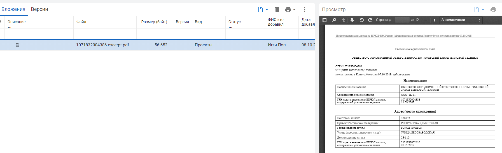

# Создание договора

## Создание договора

### **Smart Manager**


Инструментальные средства развития → Конструктор бизнес-процессов и потоков документов → Smart Manager → Smart Manager


Выбираем пункт» **Добавить документ**» - «**Договоры**», или нажимаем комбинацию клавиш **Shift + F7**

.png>)

### Картотека договоров


Логистика → Контрактно-договорной учет → Договоры → Картотека договоров


## Реквизиты договора

### Закладка **Договор**

.png>)

При создании нового договора необходимо заполнить обязательные поля, помеченные звездочкой «\*»

На вкладке «**Договор**» обязательными полями являются следующие:

* **Тип договора** - требуется выбрать один из предложенных
* **Контрагент** - требуется выбрать контрагента из списка. Если контрагента нет в системе, его необходимо завести через кнопку «добавить контрагента». Подробности в инструкции по заведению контрагентов
* **№ дог. Поставщика** - номер договора поставщика
* **Действует с**  , **Действует по** - даты действия договора


Особое внимание стоит обратить на даты договора. Если договор имеет возможность автоматически пролонгироваться, тогда ставим год 9999 , а при прекращении действия договора выпускаем доп. соглашение о закрытии договора


### Закладка **Расчеты**

.png>)

На вкладке «**Расчеты**» обязательными полями являются следующие:

* **Условия оплаты**
* **Начальная цена**» - в некоторых случаях не является обязательной к заполнению. Такое возможно, если в пункте «Условия расчетов» выбрать пункт «**По спецификации**» или пункт по «**По доп. Соглашению**»

### Закладка Дополнительно

.png>)

* Признак 1 - Площадка
* [Признак 3](../../upravlenie-mdm/prostye-spravochniki/do3.md) - Толлеранс. Допускаемый % отклонений спецификации от прихода. При превышении % будет сформирована [претензия поставщику по количеству](../../upravlenie-kachestvom/pretenzii/pretenziya-postavshiku/tipy-pretenzii.md)
* [Приход,%](../../upravlenie-mdm/prostye-spravochniki/do5.md) - % допустимой замены. При заполненом поле система позволит в рамках значения [изменять номенклатуру прихода](../../uchet/postuplenie-tovarov-i-uslug/formirovanie-prikhoda-po-grafiku-postavki/izmenenie-nomenklatury-prikhoda.md)

После того как все поля будут заполнены, нажимаем на кнопку «**Добавить**»

## Вложения

**Прикрепление вложений**. Для прикрепления вложений делаем двойной щелчок мышкой на созданном нами договоре, после этого нажимаем на три точки в центральной части экрана, открывается меню, где мы выбираем пункт «**Вложения**». Или же нажать на комбинацию клавиш **Shift + F11**

.png>)

.png>)

&#x20;Нажимаем на кнопку «**Да**»

.png>)

Указываем путь к файлу с проектом договора и нажимаем «**ОК**». Прикрепленный файл появляется во вложении, в правой части доступен предпросмотр загруженного нами файла.

## **Согласование**

Нажимаем на комбинацию клавиш **ALT+R** или кнопку «**Передать вперед**» как на рисунке ниже:.png>)

Нажимаем «**Да**».

Созданный нами договор переместился на следующую стадию.

## **Создание дополнительных соглашений к договору**

Процесс создания дополнительного соглашения к договору аналогичен, за исключением того, что при добавлении дополнительного соглашения необходимо отметить «галкой» пункт «**Дополнительное соглашение**»

.png>)

После чего выбрать договор, к которому создается дополнительное соглашение.

.png>)

Дальше делаем аналогичные действия, описанные выше.

## Работа в Smart Manager

### Просмотр запущенных договоров

В левой нижней части экрана находится кнопка меню «Избранное». В «Избранном» отображаются все задачи, переданные инициатором на дальнейшие стадии бизнес-процесса.

.png>)

После нажатия на клавишу, открывается список задач, отправленных инициатором на согласование

.png>)

Выбираем и открываем интересующую нас задачу.

.png>)

Открывается окно с описанием задачи.

### Просмотр статуса согласования&#x20;

При нажатии на клавишу “**F10**” или значок с изображением лупы мы увидим на какой стадии находится документ.

.png>)

В данном примере документ находится на стадии «Руководитель подразделения»

.png>)
