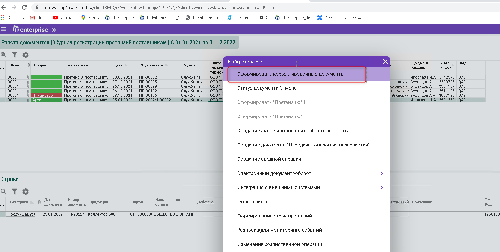

# Корректировочные документы

>Логистика → Управление документооборотом материальных и финансовых потоков → Документы → Реестр документов

Используемые процессы

* [Корректировка реализации](../../../../realizaciya/korrektirovka-realizacii.md)
* [Корректировка поступления](../../../../postuplenie-tovarov-i-uslug/formirovanie-prikhoda-po-grafiku-postavki/korrektirovka-postupleniya.md)

В реестре документов выберите документ «[Журнал регистрации претензий поставщикам (QA8)](../../../../../upravlenie-kachestvom/pretenzii/pretenziya-postavshiku/)» к Термокомпонент

1.png>)

* Нажмите «F2 –Сформировать корректировочные документы»

* Когда документы будут созданы, то выйдут сообщения

1.png>)

1.png>)
