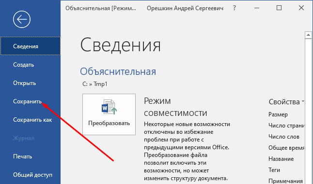

# Добавление объяснительной

Объяснительную нужно добавлять на первой стадии «Ввод»

Для добавления объяснительной есть 2 варианта:&#x20;

* &#x20;По кнопке «Создать объяснительную»

1.png>)

* Нажать F12 и выбрать метод «Создать объяснительную»&#x20;

1.png>)

После выбор одного из вариантов создания документа, откроется word документ Объяснительная для корректировки и заполнения необходимых полей

>Перед открытием документа появится данное окно, НЕ нужно нажимать «ОК» пока не отредактируете и не закроете открывшийся документ

1.png>)

После заполнения объяснительной нужно нажать «Файл» -> «Сохранить» и далее закройте документ&#x20;

1.png>)

После закрытия объяснительной нажимаем кнопку «ОК»&#x20;

1.png>)

После этого объяснительная будет сохранён во вложения документа.&#x20;
