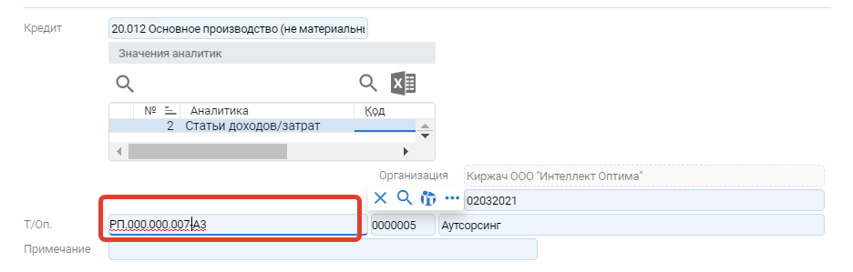

# Приход по кооперации

## Создание заголовка

.png>)

## Создание строки

.png>)

Выбор техпроцесса. Если у возвращаемой позиции есть альтернативные техмаршруты (разный материал из которого может изготавливать кооператор) необходимо выбрать из реестра

Выбрать из реестра

.png>)

В примечании описаны отличия по применяемым материалам

### Отличие норм расхода

В случае если есть отличие между нормами расхода в системе и в данных от поставщика необходимо внести корректировку в строку списания. Указать данные поставщика

>При внесении изменений мы соглашаемся с нормами поставщика

.png>)

>После внесен данных от поставщика необходимо выполнить Подбор остатков (без диалогов) (F2 -> Подбор остатков (без диалогов))
