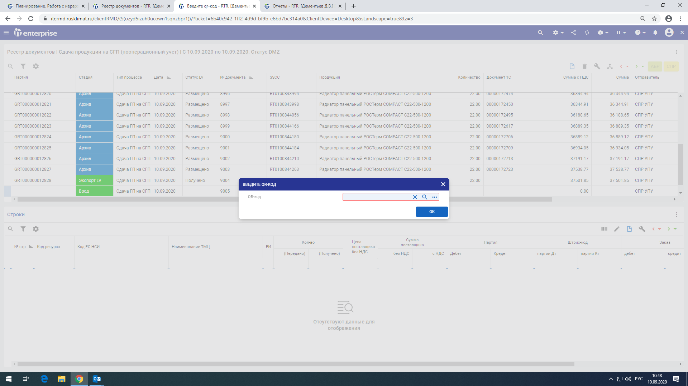

# Сдача продукции на СГП

## Создание заголовка документа

При входе в реестр документов выбрать тип процесса \_PR\_M334 - Сдача продукции на СГП (пооперационный учет)

.png>)

Указываем отправителя, получателя и тип паллета, нажимаем «Добавить»

.png>)

## Создание строки документа

Выбираем созданную строку, нажимаем «Сканировать штрихкод»\

.png>)

Вставляем в данную строку штрих-код партии

После этого вводим необходимой количество ГП, которое мы хотим сдать

Нажимаем кнопку «Передать вперед»

.png>)

После этого документ переходит в стадию «Экспорт LV» - его передают на склад ГП

По завершению обработки документ переходит в стадию «Архив». В столбце «Рзн» появляется знак «+»

.png>)

## Ответ хранение

В случае превышения продукции по заказу система помечает документ как передача на ответ хранение. После разноски документа сдачи ГП будет сформирован документ [передачи на ответ хранение](../otvet-khranenie/peredacha-na-otvet-khranenie.md)

.png>)
