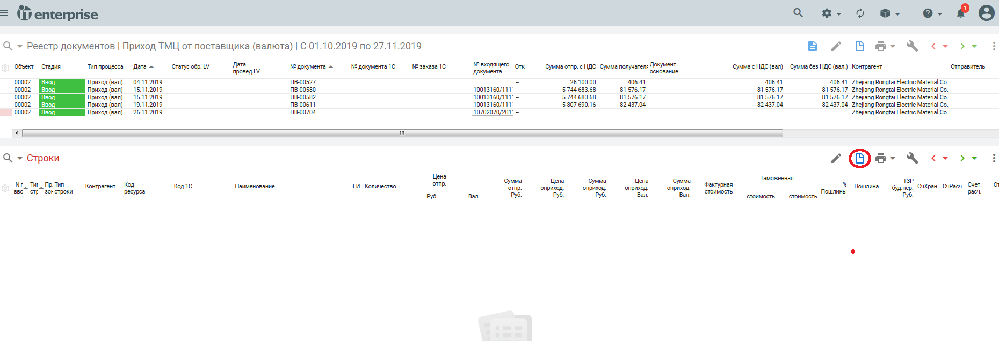

# Приход ТМЦ в валюте

>Логистика > Управление документооборотом материальных и финансовых потоков > Документы > Реестр документов

Выбираем документ Приход ТМЦ от поставщика (валюта) (документ можно найти в строке поиска)

.png>)

## **Создание заголовка документа**

Далее нажимаем кнопку Добавить или клавишу на клавиатуре F7

.png>)

### Закладка Документ

* Склад и МОЛ
* Контрагент
* Договор
* Валюту и Курс валюты «Вводимый (ВВ)»
* Тип цены

>Курс РУБ к валюте рассчитываем в ручную исходя из курса валюты на день предоплаты и курса валюты на день прохождения Границы РФ

.png>)

>Если указан тип цены Плановая - такой документ в 1с выгрузится без цены!

### Закладка Документы

Указываем номер и дату входящего документа (ГТД)

>Документ не будет разнесен в картотеку,если не заполнена вкладка Документы

.png>)

## Создание строки документа

Нажимаем кнопку Добавить (F7). Или добавляем строки по Графику поставки (F2 - [Формирование прихода на основании графика поставки](../))

Заполняем поля документа:

### **Тип строки ТМЦ**

* код ТМЦ
* кол. док-т
* цену поставщика( в валюте), сумма рассчитывается автоматически (Сумму сверяем с коммерческим инвойсом)
* процент таможенной пошлины (указанный в ГТД.), таможенная пошлина может быть не на все ТМЦ

>После выполнения режима Рассчитать суммы оприходования по ГТД система автоматически создаст строку [Пошлина ](./#tip-stroki-poshlina)и рассчитаем сумму

* таможенную стоимость (указанная ГТД)

Нажимаем кнопку-Добавить.

.png>)

### **Тип строки Таможенный сбор**

* цена в руб. (указана в ГТД)
* отправитель указываем «Межрегиональное операционное УФК (ФТС России)»

Нажимаем кнопку-Добавить.

.png>)

### **Тип строки Пошлина**

>Создается только в том случае если необходимо распределить сумму на все строки прихода ТМЦ с одинаковым процентом

* цена и сумма с ТЗР ( берем из ГТД общую сумму по всем разделам)
* процент распределения
* признак распределения

Нажимаем кнопку-Добавить

>После выполнения режима Рассчитать суммы оприходования по ГТД система автоматически в ТМЦ внесет процент и рассчитает сумму доп затрат пропорционально сумму ТМЦ

### **Тип строки Страхование**

* цена - берем из Страховки или акта выполненных услуг от Контрагента
* отправитель контрагент-страховщик
* договор
* дату документа .

.png>)

* № документа заполняем на вкладке «Дополнительно»

.png>)

Нажимаем кнопку «Добавить»

### **Тип строки ТЗР прочих контрагентов**

* цена берем из Акта выполненных работ от Контрагента
* отправитель контрагент- транспортная компания
* договор
* дату документа.

Номер документа заполняется на вкладке Дополнительно.

Нажимаем кнопку «Добавить»

.png>)

### Тип строки Прочие затраты

Аналогично заводим таможенное сопровождение и другие расходы, если возникнут

После заполнения всех Строк проверяем соответствие

* номенклатуры - количество
* суммы
* счета учета

.png>)

## Расчеты

### [Расчет по разделам ГТД](raschet-po-razdelam-gtd.md)

### Расчет суммы оприходования

Далее документ необходимо рассчитать. Устанавливаем курсор на строчные части документа (нижнее поле), нажимаем F2 => выбираем «Рассчитать суммы оприходования по ГТД»

.png>)

После расчета документа сравниваем итоговые значения в колонках «Сумма отпр.руб.» и «Сумма оприход. Руб.» - они должны быть равны (все затраты распределились правильно)

.png>)

Далее документ Передать вперед (в правом верхнем углу зеленая стрелка).

В поле экрана Реестр документов в колонке Рзн появился +. Документ разнесен в картотеку (проведен).

.png>)

> Отклонения в случае если спецификация с российским поставщиком заключена в валюте но приход необходимо оформить в рублях
>
> 1. Создаем заголовок валютного прихода и выбираем валюты спецификации
> 2. Формируем строки по графику поставок
> 3. Меняем валюту документа на рубли
> 4. Корректируем сумму и цену добавленных строк, указываем ставку НДС
>
> Расчет суммы оприходования по ГТД выполнять не нужно!
