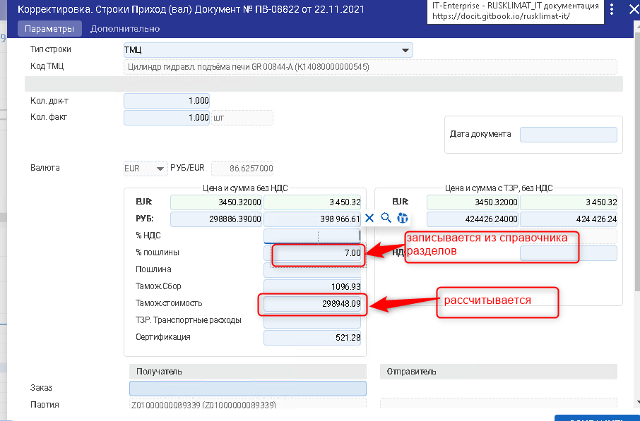

# Расчет по разделам ГТД

### **Раздел ГТД**

* Выберите строки (поставив слева галочку), которым надо установить раздел, например, раздел 1:

1.png>)

* Нажмите «F2 – Расчет стоимости по ГТД – Добавить раздел к строке»

1.png>)

Появится интерфейс «Разделы ГТД» К ТЕКУЩЕМУ ДОКУМЕНТУ

1.png>)

>Если разделы к этому документу прихода не были добавлены, то в интерфейсе не будет записей

* Для добавления раздела нажмите кнопку «Добавить раздел»

1.png>)

* В появившемся окне заполните поля:
  * Раздел № - Номер раздела
  * Сумма - Сумма по разделу для распределения
  * Процент - Процент пошлины

>Поле **«Номер документа прихода»** проставляется автоматически и закрыто на редактирование

1.png>)

И нажмите кнопку «Добавить». После этого раздел появится в списке:

1.png>)

>Можно добавить сразу все разделы документа

* Встаньте курсором на раздел, который необходимо прописать к выделенным строкам и нажмите кнопку «Выбрать»

1.png>)

* После этого для выделенных строк установится раздел

1.png>)

* Аналогичным образом установите разделы для всех строк с типом «ТМЦ»

### **Расчет таможенной стоимости**

* Встаньте курсором на строки прихода запустите Рассчитать таможенную стоимость по разделам ГТД (F2 –> Расчет стоимости по ГТД –> Рассчитать таможенную стоимость по разделам ГТД)

1.png>)

* При этом рассчитается таможенная стоимость и пропишется процент из справочника разделов ГТД

>Если в документе есть строки, у которых раздел не указан, то таможенная стоимость не рассчитывается и об этом выходит сообщение

1.png>)

### **Расчет пошлины**

* Встаньте курсором на строки прихода и запустите Рассчитать суммы оприходования по ГТД (F2 –> Расчет стоимости по ГТД –> Рассчитать суммы оприходования по ГТД)

При этом рассчитается таможенная стоимость и пропишется процент из справочника разделов ГТД

1.png>)
