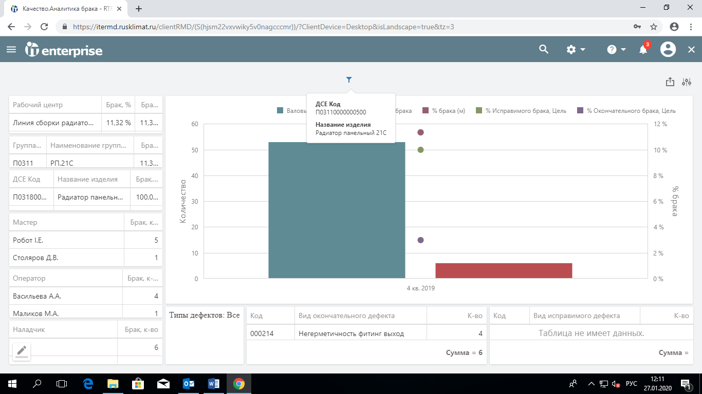
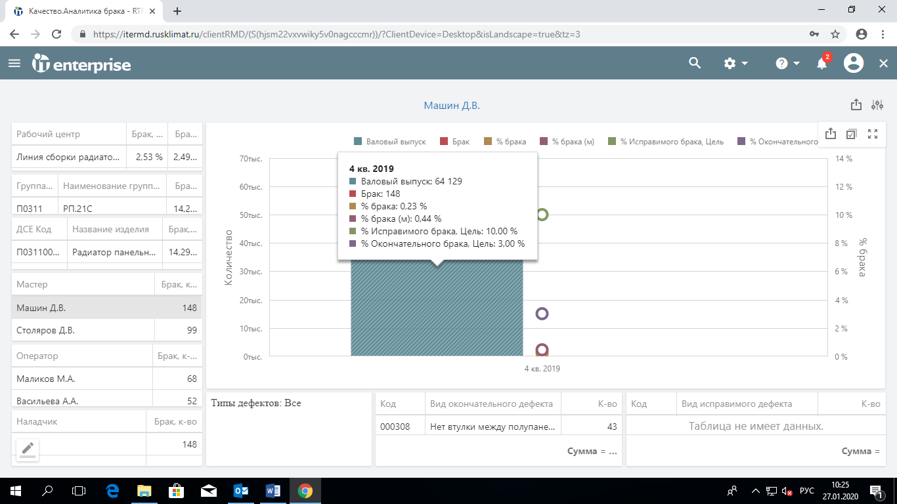
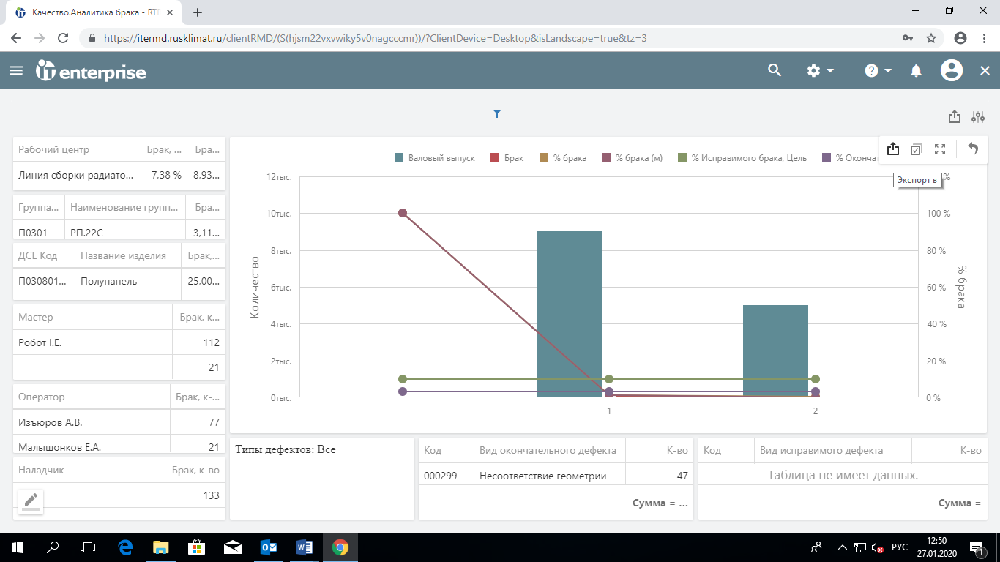

# Аналитика брака с объемом продукции

1. Выбрать раздел «Качество. Аналитика брака с объемом продукции»

.png>)

**Качество. Аналитика брака с объемом продукции**

1. Выбрать анализируемый период: год, квартал, месяц, неделя, день или другой необходимый период, нажать «ОК»

.png>)

**Дата окончания периода**

**Дата начала периода**

1. .png>)Дату можно внести вручную или поставить курсор в нужную ячейку, выбрать значок «Календарь» и найти нужную дату в календаре.

.png>)

**Кликая левой кнопкой мыши можно перемещаться по календарю**

1. **Для примера** сформирован отчет за 4 квартал 2019 года.

.png>)

1. .png>)Перед началом работы с данными сформированного отчета необходимо сбросить фильтр.

Для этого нажать значок , расположенный в верхнем правом углу. В окне «Параметры панели» нажать «Сброс», затем нажать «Отправить».

.png>)

Нажать, чтобы появилось окно «Параметры панели»

Нажать «Сброс»,

затем «Отправить»

1. Чтобы ознакомиться с общим объемом выпуска, показателями брака в количественном и процентном соотношении, а также с целями по браку на данный период навести курсор на график.

.png>)

.png>)

1. .png>)Посмотреть детальный отчет по каждому месяцу (общий объем выпуска, показатели брака в количественном и процентном соотношении, а также цели по браку на данный период): двукратно нажать левой кнопки мыши на график квартала.

Вернуться к предыдущему графику с помощью значка

.png>)

**Месяцы квартала**

**Выбранный период**

**4 кв. 2019**

1. Для обновления данных в таблицах навести курсор на интересующий период и однократно нажать левую кнопку мыши (на столбце появится диагональная штриховка)

.png>)

_Диагональная штриховка выбранного периода._

_В таблицах указаны данные выбранного периода_

1. .png>)Посмотреть детальный отчет по рабочим дням: двукратно нажать левой кнопкой мыши на график необходимого месяца.

К предыдущему графику можно вернуться с помощью значка

.png>)

1. Посмотреть информацию посменно: двукратно нажать левой кнопкой мыши на график рабочего дня.

.png>)

**1 – первая смена;**

**2 – вторая смена**

1. Посмотреть брак по типам дефектов (окончательный/исправимый).

Развернуть необходимую таблицу в нижней части окна. На графике должен отображаться необходимый период (в данном случае 4 кв. 2019)

.png>).png>)

**Развернуть**

1. Откроется таблица с видами окончательных/исправимых дефектов и количеством выявленных случаев в отчетном периоде. Для возврата к графику нажать «Восстановить»

Количество выявленных случаев за отчетный период **130**

.png>).png>).png>)

Вид окончательного дефекта **«Прожог конвектора»**

**Восстановить**

1. &#x20;Количество забракованной продукции по рабочим центрам за отчетный период.

Слева вверху представлена таблица с рабочими центрами СПР.

Выбрать рабочий центр методом прокрутки или «развернуть» таблицу как указано выше, выбрать рабочий центр/несколько центров и нажать «восстановить». На графике отобразятся данные выбранного рабочего центра/рабочих центров.

.png>)

**После просмотра информации нажать на значок, чтобы сбросить фильтры**

**Развернуть для выбора другого рабочего центра**

**Наименование выбранного рабочего центра**

1. Для просмотра информации по другим рабочим центрам необходимо сбросить фильтр и выбрать рабочий центр.

Аналогично при сортировке по другим параметрам: чтобы вернуться к исходным данным необходимо сбрасывать фильтр.

.png>)

**Нажать на значок, чтобы сбросить фильтры**

1. Количество забракованной продукции по названию изделия.

Выбрать необходимое изделие (см. п.13)

**Таблица с наименованиями и кодами изделий**

**Наименование и код выбранного изделия**

1. Количество забракованной продукции по сотрудникам за отчетный период.

Слева представлены таблицы с разбивкой по должностям. Возможен выбор сотрудника из таблицы мастеров или операторов.

Выбрать (однократным нажатием левой кнопки мыши) в таблице слева необходимого сотрудника (можно выбрать любого сотрудника из таблиц методом прокрутки или «развернуть» таблицу как указано выше, выбрать сотрудника/сотрудников и нажать «восстановить»).

.png>).png>).png>)

**Фамилия и инициалы мастера**

1. Посмотреть данные по видам окончательного/исправимого дефектов у выбранного сотрудника в таблицах в нижней части окна.

.png>).png>).png>)

**Данные по видам дефектов**

**Фамилия И.О. мастера**

1. Экспортировать (сохранить на устройство) все данные графика или любой представленной в окне таблицы можно с помощью значка

.png>).png>).png>).png>)

**Экспорт графика**

**Экспорт всех данных**

**Экспорт таблицы**

1. Выбрать необходимый формат экспортируемого документа (pdf, изображение, excel): навести курсор на выбранный формат, нажать левую кнопку мыши.

.png>)

**Выбрать требуемый формат экспортируемой информации**

1. &#x20;В открытом окне указать наименование файла для сохранения и нажать «Экспорт»

.png>)

**Поле для заполнения наименования файла**

1. Экспортированный файл с указанным наименованием появится внизу страницы.

Открыть файл для просмотра. На устройстве файл сохранится в папке «Загрузки» .png>)

**Экспортированный файл с указанным Вами наименованием и в выбранном формате**
