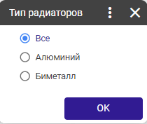

# Контроль протечек

>Управление производством → Управление качеством → Контроль и анализ процессов → Контроль протечек

При запуске форма предлагает выбрать интересующий диапазон (Предыдущий месяц для анализа берется автоматически)

1.png>)

## **Протечки**

1.png>)

При нажатии **F9** предлагается сменить диапазон

## **Парето**

При первом запуске берутся даты выбранные на странице "Протечки" и все типы радиаторов (BI,AL)\
При нажатии **F9** предлагается сменить диапазон и выбрать тип радиаторов.&#x20;

1.png>)
