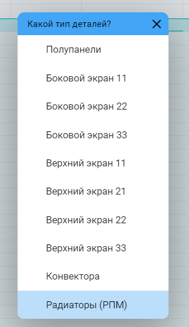

# Расчет площади радиатора

Рассчитываемые характеристики ([Используются для расчета норм окраски](../../../../pdm/pdm-tpp/normirovanie/normirovanie-peredelov/normirovanie-okraski.md))

* R29 - Площадь окрашивания (м2)
* R69 - Площадь общая (м2)

Использовать только для номенклатуры СПР

Для расчета необходимо выбирать номенклатуру в классификаторе ресурсов и запустить расчет площади (F2 > Рассчитать площадь > Расчет площади)

.png>)

Выбрать тип детали

Тип радиатора

>)

Что бы проверить заходим F12>дополнительные характеристики

>)
