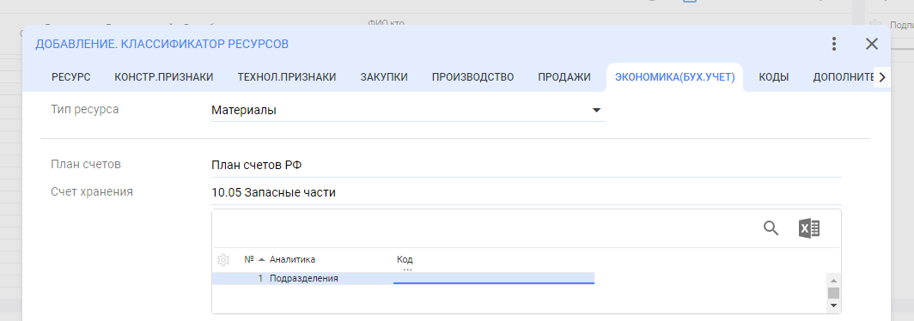
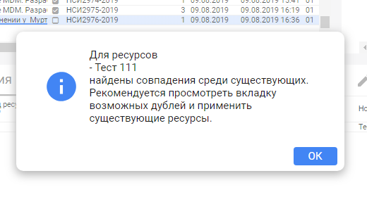
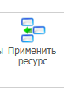
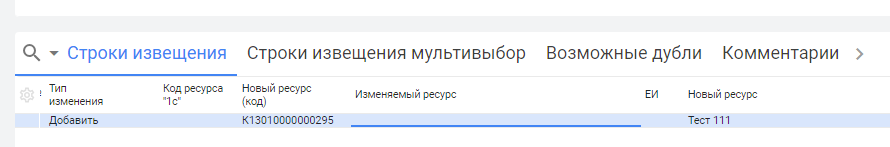

# Создание заявок НСИ

>Администрирование системы → Управление основными данными (MDM) → Ресурсы → Изменения Классификатора

.png>)

## Создание заголовка

Нажимаем «**ДОБАВИТЬ**» или «**F7**»

.png>)

В данном окне все заполняется **АВТОМАТИЧЕСКИ**

Нажимаем кнопку «**ДОБАВИТЬ**»

.png>)

Заявке присвоена стадия «**ЗАЯВКА**»

## Создание строки

Теперь необходимо заполнить обязательные поля, встаем курсором на поле «**СТРОКИ ИЗВЕЩЕНИЯ**»

И нажимаем «**ДОБАВИТЬ**» или «**F7**»

.png>)

ВЫБРАТЬ «**ТИП ИЗМЕНЕНИЯ**»: Добавить, Изменить, Удалить

В поле «**ДОБАВЛЯЕМЫЙ РЕСУРС**» выбираем нужный нам **КОД РЕСУРСА,** после того как выбрали группу классификатора нажимаем **«ДЕТАЛЬНО»**

.png>)

Например : Для того что бы завести «Фитинг литой для радиатора» нужно выбрать

К- Комплектующие (1-й уровень классификатора) -> К13-Фитинги и Комплектующие (2-й уровень классификатора) -> К1301 Фитинги (3-й уровень классификатора) НУЖНЫЙ НАМ УРОВЕНЬ

.png>)

>Если второй уровень (М01, К70 и др.) помечены «**!!!**» - в данные группу номенклатуру заносить нельзя!

Если Вы не нашли подходящей группы,- свяжитесь со специалистом НСИ

Поля «**ОБОЗНАЧЕНИЕ**», «**НАИМЕНОВАНИЕ**» и «**ГОСТ**» заполняются вручную

Поля «**ПРИЗНАК НАИМЕНОВАНИЯ**» и «**УЧЕТНАЯ ЕИ**» заполняются автоматически в соответствии с выбранной группой

.png>)

Поле «**ПРИЗНАК ИЗГОТОВЛЕНИЯ**»

* **Собственного изготовления -** свои полуфабрикаты и готовая продукция
* **Покупные** – **** вся остальная номенклатура

.png>)

Далее заходим на вкладку **«Экономика(бух.учет)»** и заполняем поля **«Тип ресурсов»** и **«Счет хранения»**

| **Группа** | **Наименование**            | **Счет хранения**                      | **Наименование**                                                               |
| ---------- | --------------------------- | -------------------------------------- | ------------------------------------------------------------------------------ |
| G          | Готовая продукция           | 43.01                                  |                                                                                |
| Г          | Изделия по ГОСТам           | 10.02                                  | Покупные п/фабрикаты и комплектующие изделия                                   |
| Д          | Нормативно-техническая док. | -                                      |                                                                                |
| И          | Инструмент                  | 10.09                                  | Инвентарь и хозяйственные принадлежности                                       |
| К          | Комплектующие               | 
10.02

(Кроме К14 – 10.05)
 | 
Покупные п/фабрикаты и комплектующие изделия

К14 - Запасные части
 |
| М          | Материалы                   | 10.01                                  | Сырье и материалы                                                              |
| О          | Оборудование                | 10.05                                  | Запасные части                                                                 |
| П          | ДСЕ продукции               | 21                                     | Полуфабрикаты собственного производства                                        |
| У          | Услуги                      | 10.07.2                                | ДСЕ, переданные в переработку на сторону                                       |

| **Группа** | **Наименование**            | **Тип ресурса**                                                                                                              |
| ---------- | --------------------------- | ---------------------------------------------------------------------------------------------------------------------------- |
| G          | Готовая продукция           |  ПродукцияГотовая                                                                                                            |
| Г          | Изделия по ГОСТам           | 
ПокупныеИзделия

 (Г50 – ИнструментТехоснастк)
                                                                   |
| Д          | Нормативно-техническая док. |  Не проставляем                                                                                                              |
| И          | Инструмент                  | ИнструментТехоснастк                                                                                                         |
| К          | Комплектующие               | 
ПокупныеИзделия

К50 – Упаковка

К14 – Оборудование

К17 - Материалы
                                   |
| М          | Материалы                   | 
Материалы

М00 – ВозвратныеОтходы

М40 – ЧерныйМеталл

 (кроме М4007, М40А0, М40А1 - НержавеющаяСталь)
 |
| О          | Оборудование                | 
Оборудование

О18 – ИнструментТехоснастк
                                                                         |
| П          | ДСЕ продукции               | Полуфабрикаты                                                                                                                |
| У          | Услуги                      | Услуги                                                                                                                       |

Нажимаем «**ДОБАВИТЬ**»

.png>)

Выделяем курсором строчку заявки и передаем заявку на проверку Специалисту НСИ

.png>)

Статус измениться со стадии «**ЗАЯВКА**» в стадию «**ПРОВЕРКА**»

.png>)

Если по названию добавляемого ресурса найдены совпадения в классификаторе, система предложит выбрать из существующих…

Если среди предложенных ресурсов нет подходящего то заявка передается дальше на проверку, если есть подходящий ресурс , выделяем строку с его наименованием. Далее на панели инструментов нажимаем кнопку 

.png>)

.png>)

* Если после стадии «**ПРОВЕРКА**» заявка вернулась на стадию «**ЗАЯВКА**», значит Специалист НСИ вернул заявку на доработку и необходимо посмотреть вкладку «**КОМЕНТАРИИ**»

* Если заявка вернулась на доработку с комментарием, ее нужно принять на редактирование нажав на панели инструментов кнопку

.png>)

После исправления ошибок, заявку передаем на стадию «**ПРОВЕРКА**»
