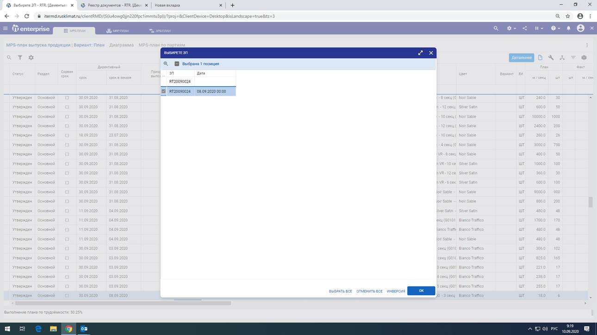

# Формирование MPS

## Ручное пополнение плана производства

>Управление производством → Управление производством и загрузкой мощностей → Планирование → MPS, MRP-планирование

### Пополнение

F2 -> MPS-планирование –> Пополнить MPS план заказами покупателей

.png>)

Ввести необходимый номер заказа и выбрать его из списка, нажать «ОК»

### Заполнение Дир. даты и приоритета

Выделяем наш заказ, в столбце «Приоритет выполнения» вписываем приоритет и нажимаем «Заполнить для всех». Нажимаем F2, выбираем «Проставить директивный срок»

.png>)

### Контроль правильности плана

Сравнить строки заказа со строками документов в «Заказы сбыта» по данному заказу

1. Количество в MPS с количеством в заказе покупателя
2. Номенклатура в заказе и в плане

.png>)

.png>)

## Пополнение по бизнес-процессу

Бизнес-процесс заказов сбыта

В работе!!!
