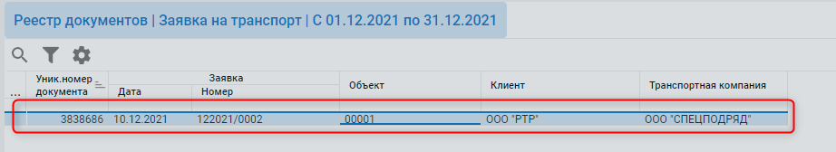
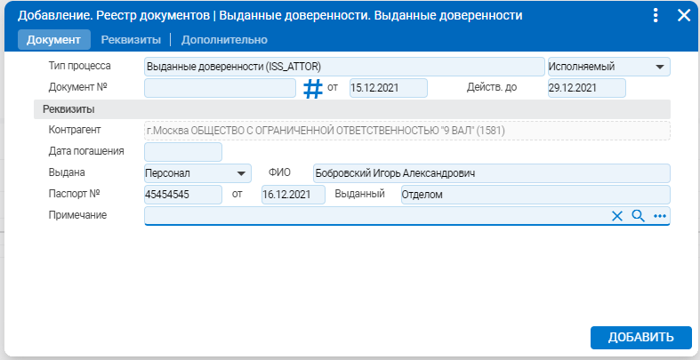

# Доверенность на доставку

### Формирование доверенности 

По текущий строке заголовка документа «Заявка на транспорт»

Вызываем режим F2 -> Формирование доверенности

1.png>)

Откроется форма добавление документ «Доверенности»:

* Дата и номер документа доверенности (заполняются автоматически)
* Действ. до – дата до которой действует доверенность
* Контрагент (подтягивается из заявки на транспорт)
* Выдана – выбор из списка (Персонал – выбор по справочнику сотрудников, Другое – выбор из справочника водителей контрагента)
* Данные паспорта

Нажимаем «Добавить»

### Печатная формы 

Встать курсором на заголовок документа и нажать кнопку «Печать» () или вызвать печать через F5:

1.png>)

В списке будут все доступные отчеты (Типовая форма М-2. Доверенность). Выбрать отчет и нажать кнопку «Печать»:

1.png>)
