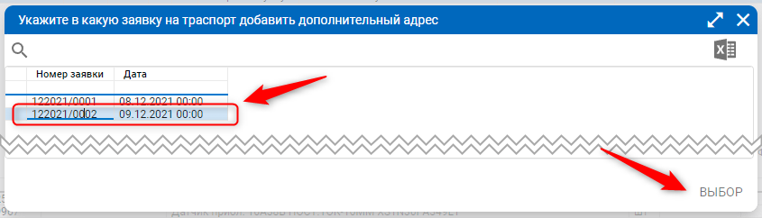
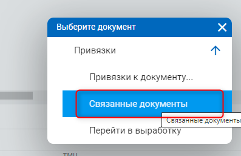
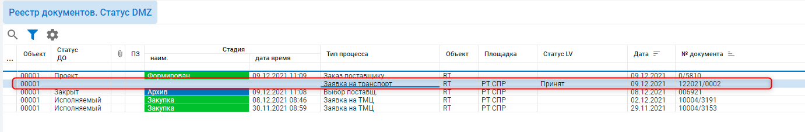
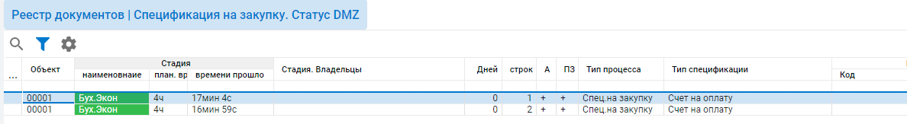

# Заявка на транспорт

### Формирования заявки по спецификации 

По текущий строке или в режиме множественного выбора выделяем документы спецификации:

1.png>)

Вызываем режим F2 “Формирование заявки на транспорт”:

1.png>)

Откроется форма добавления документа «Заявка на транспорт»:

Вкладка «Основная»:

* Внутренний номер и дата заявки
* Клиент (заполняется автоматически по объекту).
* Признак собственным транспортом
* Транспортная компания (в случае указания признака подтягивается клиент, поле будет закрыто на изменение)

1.png>)

Вкладка «Груз/Транспорт»:

Поля особые условия и тип транспортного средства выбираются из справочника

1.png>)

После ввода данных и сохранения открывается интерфейс с новой заявкой на транспорт:

1.png>)

Далее необходимо заполнить строки документа. Строки формируются автоматически на основании спецификаций:

Тип строк:

* Погрузка - дата и адрес отгрузки
* Доп.адрес (добавляется если привязываются несколько спецификаций)
* Разгрузка - дата и адрес доставки)

Для каждого типа строк нужно указать дату и адрес:

1.png>)

### Привязать спецификацию к созданной заявке 

По текущий строке или в режиме множественного выбора выделяем документы спецификации:

1.png>)

Вызываем режим F2 “Формирование заявки на транспорт”:

1.png>)

Выбираем из списка заявку, которую хотим привязать:

Заполняем все данные в форме (организация подставляется автоматически из спецификации)

1.png>)

В заявку добавляется новая строка с типом строк «Доп. Адрес»

### Просмотр связанных документов 

По спецификации вызвать режим F12 “Связанные документы”

В списке документов будет заявка на транспорт:

Либо на заявку вызвать режим F12 “Связанные документы”, откроется реестр документов со спецификациями привязанное к данной заявке

### Печатная формы 

Встать курсором на заголовок документа и нажать кнопку «Печать» () или вызвать печать через F5:

1.png>)

В списке будут все доступные отчеты (Заявка, Транспортная накладная). Выбрать необходимый отчет и нажать кнопку «Печать»:

1.png>)

После печати можно внести изменение в документ, сохранить его. Тогда изменений документ сохранится во вложении:

1.png>)

